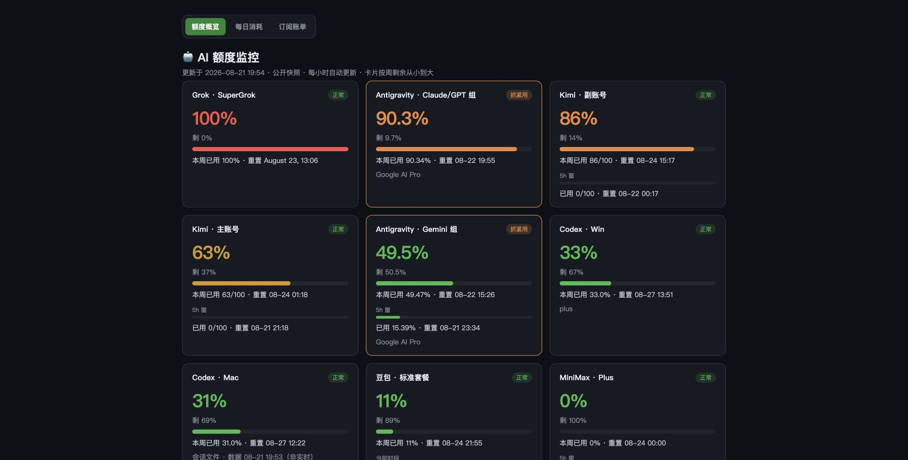
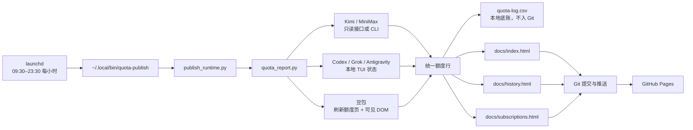
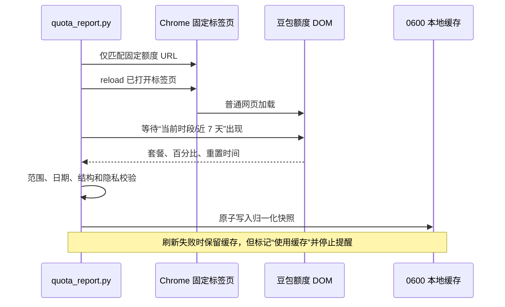
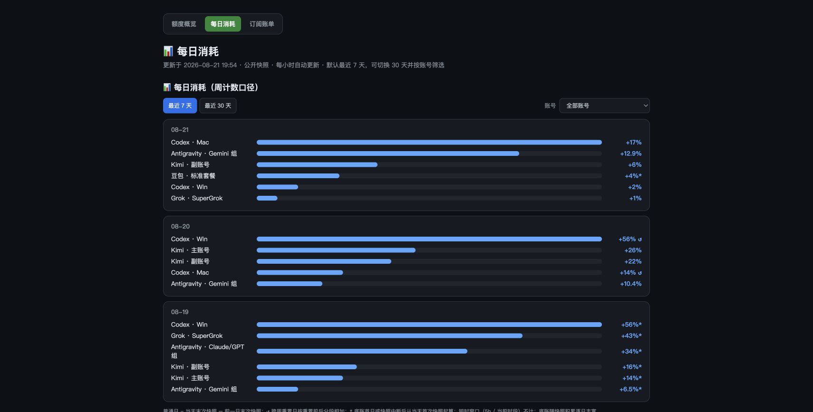

# AI Quota Monitor：项目流程与设计说明

这个项目把多种 AI 产品互不相同的额度口径，归一化成一个适合个人日常决策的公开仪表盘。核心问题不是“抓到一个百分比”，而是保证这个数字来源明确、刷新时间可信、跨周计算不误导，并且查询本身不消耗模型额度。



## 1. 目标与原则

项目围绕五条原则设计：

1. **周额度优先**：主卡片统一展示本周已用和剩余比例，方便跨产品比较。
2. **短时窗口只作补充**：5 小时窗或“当前时段”显示为子进度条，不混入每日周额度消耗。
3. **不发模型任务**：所有查询都是只读接口、状态命令或官网可见 DOM，不发送提示词。
4. **宁可明确使用缓存，也不伪装实时**：采集失败时保留最后一份有效数字，但停止提醒并标明失败原因。
5. **公开内容最小化**：只发布用户确认可以公开的额度、账单和汇总；凭据、原始 DOM、本地会话及详细日志不进入仓库。

## 2. 端到端数据流



定时入口安装在 `~/.local/bin`，是为了避开 macOS 对 Documents 目录中后台 Shell 脚本的 TCC 限制。它只负责调用仓库内唯一的 Python 发布器；手动执行 `publish.sh` 也进入同一个发布器，避免两套逻辑漂移。

## 3. 各数据源如何取数

| 数据源 | 方式 | 是否产生模型 token | 主要限制 |
|---|---|---:|---|
| Kimi for Coding | 官方 usage API，只读已有使用量 | 否 | 依赖本地已配置的账号凭据 |
| 豆包个人会员 | 刷新已登录的额度管理页，读取可见 DOM | 否 | Chrome、固定标签页和 Apple 事件 JavaScript 必须可用 |
| Codex · Mac | 隐藏 tmux 会话读取 `/status`，并参考本地会话重置时间 | 否 | CLI 需要已登录 |
| Codex · Win | SSH 读取远程机最新会话的 rate limit | 否 | 远程机和网络必须可达 |
| Grok | 隐藏 TUI 读取 `/usage` 状态面板 | 否 | CLI 需要已登录 |
| MiniMax | 官方 CLI 的 quota JSON | 否 | CLI 需要已登录 |
| Antigravity | 隐藏 TUI 读取 `/usage` 状态面板 | 否 | CLI 需要已登录 |

所有适配器最终输出统一字段：来源名称、状态、周已用百分比、周重置时间，以及可选的短时窗口百分比和重置时间。动态文本进入 HTML 前统一转义。

## 4. 额度与提醒口径

### 周额度

- 主百分比是“本周已用”，剩余量按 `100 - used_pct` 计算。
- 卡片按周剩余从少到多排列，最需要处理的账号靠前。
- 百分比必须在 `0–100`；非法数字不会进入缓存或页面。

### 短时窗口

- Codex、Grok、Antigravity 等来源可显示 5 小时窗；豆包显示“当前时段”。
- 短时窗口不计入“每日消耗”，否则会把同一使用行为重复计算。
- Kimi 的使用建议只看周窗口：周刷新还很远时，不因为 5 小时窗即将刷新而提示“抓紧用”。

### 每日消耗

- 普通日：当天最后一份周快照减去前一天最后一份周快照。
- 周重置日：把重置前消耗和重置后消耗分段相加。
- 快照中断或缺少自然日时，只从当天第一份可信快照开始计算，避免把数日用量全部记到恢复当天。
- 同一窗口内偶发的数值回跳视为数据抖动，不伪造一次周重置。

## 5. 豆包自动刷新流程



这条流程不会新开网页、点击按钮、读取 Cookie、localStorage、Token 或完整 DOM，也不会调用模型。套餐名只接受离额度区最近的“订阅与额度管理”标题相邻字段，避免把账号昵称误当作套餐发布。

## 6. 页面拆分

- `docs/index.html`：额度概览、短时窗口、紧急提醒和最近两天摘要。
- `docs/history.html`：7/30 天切换、账号筛选和每日消耗。
- `docs/subscriptions.html`：AI 订阅、历史充值和用户明确允许公开的非 AI 固定支出。



拆成三个页面是为了避免单页持续增长后难以浏览，也让额度决策、历史分析和账单盘点各自保持清晰。

## 7. 定时、睡眠、断网与发布

- 当前 LaunchAgent 使用 `StartCalendarInterval`，每天 09:30–23:30 每小时运行一次。
- Mac 睡眠期间错过多个时间点，唤醒后通常合并补跑一次，而不是逐小时补齐。
- Mac 关机期间不会运行；当前 `RunAtLoad=false`，开机登录后等待下一个计划时间。
- 没有网络时 launchd 仍会启动，但联网数据源或 GitHub 推送可能失败；下一个有网的计划任务会再次尝试，并推送本地尚未同步的提交。
- 只有三个公开 HTML 页面会进入自动快照提交；发布器不会顺带提交用户已经暂存的其他文件。

## 8. 隐私与安全边界

公开仓库包含用户明确选择公开的额度与费用汇总，但以下内容不会发布：

- API key、Cookie、登录 Token、Authorization header；
- 豆包完整页面文本、账号昵称和浏览器存储；
- `quota-log.csv` 与本地 `quota-dashboard.html`；
- CLI 会话原文、SSH 私钥和本机配置。

豆包缓存位于 `~/.cache/ai-quota-monitor/doubao-quota.json`，权限为 `0600`，只含套餐、百分比、重置时间和采集时间。Chrome 的“允许来自 Apple 事件的 JavaScript”是全局开发者选项，应只授予可信本地自动化。

## 9. 失败处理

| 场景 | 页面行为 |
|---|---|
| 单个数据源不可用 | 显示异常卡片，其他来源继续生成 |
| 豆包实时刷新失败但有缓存 | 显示“使用缓存”、采集时间和安全化原因；不产生额度提醒 |
| 豆包缓存超过阈值 | 额外显示“快照已过期” |
| 百分比或日期非法 | 拒绝整次豆包快照，不覆盖上一份有效缓存 |
| 页面动态文本含 HTML | 输出前转义，避免注入公开页面 |
| GitHub 推送失败 | 保留本地提交，等待后续计划任务再次推送 |

## 10. 测试与验收

```bash
python3 -m unittest discover -s tests -v
python3 -m py_compile quota_report.py publish_runtime.py
bash -n publish.sh scripts/*.sh
osacompile -o /tmp/read_doubao_quota.scpt scripts/read_doubao_quota.applescript
```

关键运行时验收包括：

- 真实 Chrome 刷新后，Navigation Timing 的类型必须为 `reload`；
- 豆包刷新后必须写入新的采集时间和页面可见额度；
- launchd smoke 输出 `INSTALL_RUNTIME_PASS` 且退出码为 0；
- 完整 launchd 流程必须生成三页、提交、推送，并由 GitHub Pages 构建同一提交；
- 线上页面的生成时间与额度字段必须和提交内容一致。

## 11. 主要文件

- [`quota_report.py`](../quota_report.py)：数据源、归一化、计算和 HTML 生成。
- [`publish_runtime.py`](../publish_runtime.py)：唯一的生成、提交和推送流程。
- [`publish.sh`](../publish.sh)：手动发布入口。
- [`scripts/read_doubao_quota.applescript`](../scripts/read_doubao_quota.applescript)：Chrome 标签页刷新与最小 DOM 提取。
- [`scripts/quota-publish-launchd.sh`](../scripts/quota-publish-launchd.sh)：安装到 Documents 外的稳定 launchd 入口。
- [`tests/`](../tests/)：额度计算、隐私、HTML 转义、运行时和发布回归测试。

项目选择的是“可解释、可验证的个人自动化”，而不是追求不可审计的全自动抓取：每一个数字都能说明来源，每一次降级都能在页面上看见，每一个定时发布步骤都能用本地测试和远端提交复核。
